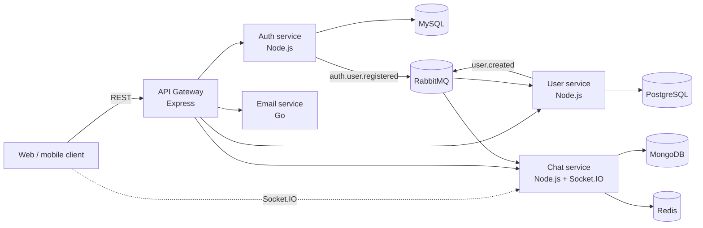

# Pulse — Microservices Chat Backend

[](https://github.com/Tarun222999/fullstack_microservice/actions/workflows/ci.yml)


Pulse is the backend platform for personal, realtime conversations. It is built as a polyglot microservices system with REST APIs, Socket.IO messaging, event-driven data synchronization, email invitations, and a complete local observability stack.

> This repository contains the backend services and infrastructure. The product interface shown below is a separately deployed client that consumes these APIs.


## Product preview

Authenticated users can discover people, start direct conversations, and exchange messages in realtime.


## What this backend provides

- Registration, login, access-token refresh, and refresh-token revocation
- User profiles, directory search, and direct-message candidate discovery
- Direct and multi-participant conversations with message history
- Authenticated Socket.IO rooms and realtime message delivery
- Redis-backed Socket.IO scaling and conversation caching
- RabbitMQ events for eventually consistent user projections
- Transactional outbox publishing and consumer idempotency controls
- Chat invitation emails through Resend
- OpenAPI documentation served through Swagger UI
- Structured logs, metrics, and distributed traces through OpenTelemetry
- Ready-to-use Grafana dashboards backed by Prometheus, Loki, and Jaeger
- Automated linting, type checks, tests, formatting checks, builds, and Railway deployment workflows

## Architecture



Each service owns its domain and datastore. The gateway is the public REST facade, while RabbitMQ propagates domain events between services without sharing databases.

### Services

| Service           | Responsibility                                                     | Local port | Data/dependencies                    |
| ----------------- | ------------------------------------------------------------------ | ---------: | ------------------------------------ |
| `gateway-service` | Public REST API, authentication guard, service proxy, Swagger UI   |     `4000` | Auth, user, chat, and email services |
| `auth-service`    | Credentials, JWTs, refresh tokens, auth events                     |     `4003` | MySQL, RabbitMQ                      |
| `user-service`    | Profiles, user discovery, user events                              |     `4001` | PostgreSQL, RabbitMQ                 |
| `chat-service`    | Conversations, messages, cache, realtime sockets                   |     `4002` | MongoDB, Redis, RabbitMQ             |
| `email-service`   | Branded chat-invitation delivery                                   |     `4004` | Resend API                           |
| `packages/common` | Shared middleware, errors, event contracts, logging, and telemetry |          — | Workspace package                    |

## Technology stack

| Area                    | Technologies                                                                         |
| ----------------------- | ------------------------------------------------------------------------------------ |
| Services                | Node.js 22, TypeScript, Express 5, Go                                                |
| Realtime                | Socket.IO, Redis adapter                                                             |
| Data                    | MySQL, PostgreSQL, MongoDB, Redis                                                    |
| Messaging               | RabbitMQ, transactional outbox, idempotent consumers                                 |
| Validation and security | JWT, bcrypt, Helmet, schema-based request validation, internal service tokens        |
| Observability           | OpenTelemetry, Prometheus, Loki, Jaeger, Grafana, Grafana Alloy                      |
| Tooling                 | pnpm workspaces, Vitest, Supertest, Testcontainers, ESLint, Prettier, Docker Compose |
| Delivery                | GitHub Actions, Railway                                                              |

## Quick start with Docker

### Prerequisites

- Docker Desktop, or Docker Engine with Compose
- Git

Node.js, pnpm, and Go are only required when running services or checks directly on the host.

### 1. Clone the repository

```bash
git clone https://github.com/Tarun222999/fullstack_microservice.git
cd fullstack_microservice
```

### 2. Create your environment file

macOS/Linux:

```bash
cp .env.example .env
```

PowerShell:

```powershell
Copy-Item .env.example .env
```

Replace the example secrets and passwords before using the stack outside local development. Set `RESEND_API_KEY` and `EMAIL_FROM` to working values if you want chat-invitation emails to be delivered.

### 3. Start the platform

```bash
docker compose up --build -d
```

Check container health:

```bash
docker compose ps
```

Once the services are healthy, open [Swagger UI](http://localhost:4000/docs) or call the gateway health check:

```bash
curl http://localhost:4000/health
```

### 4. Stop the platform

```bash
docker compose down
```

This preserves database and monitoring volumes. Add `--volumes` only when you intentionally want to remove local persisted data.

## Local endpoints

### Application

| Resource             | URL                                  |
| -------------------- | ------------------------------------ |
| Gateway REST API     | `http://localhost:4000`              |
| Swagger UI           | `http://localhost:4000/docs`         |
| Raw OpenAPI document | `http://localhost:4000/openapi.yaml` |
| Socket.IO server     | `http://localhost:4002`              |
| RabbitMQ management  | `http://localhost:15672`             |

The default local RabbitMQ credentials are `guest` / `guest`. Change them for any shared or deployed environment.

### Observability

| Tool          | URL                      | Purpose                                 |
| ------------- | ------------------------ | --------------------------------------- |
| Grafana       | `http://localhost:3000`  | Dashboards and cross-signal exploration |
| Prometheus    | `http://localhost:9090`  | Metrics queries                         |
| Jaeger        | `http://localhost:16686` | Distributed trace exploration           |
| Loki          | `http://localhost:3100`  | Centralized log storage                 |
| Grafana Alloy | `http://localhost:12345` | Local log collection status             |

Grafana uses the `GRAFANA_ADMIN_USER` and `GRAFANA_ADMIN_PASSWORD` values from `.env`.

## API and realtime contracts

The gateway exposes HTTP endpoints for:

- `/auth` — register, login, refresh, and revoke
- `/users` — profiles, search, and direct-message candidates
- `/conversations` — conversation and message operations
- `/direct-conversations` — create or reopen a one-to-one conversation
- `/chat-invites` — send an authenticated invitation email

The complete HTTP contract is in [`docs/openapi.yaml`](./docs/openapi.yaml) and is rendered at `/docs` while the gateway is running.

Socket.IO clients authenticate with an access token and use these core events:

- `conversation:join`
- `conversation:leave`
- `message:send`
- `message:new`
- `message:error`

Payloads and acknowledgements are documented in [`docs/socketio-appendix.md`](./docs/socketio-appendix.md).

## Development and verification

Install the workspace dependencies with the versions declared by the repository:

```bash
corepack enable
pnpm install --frozen-lockfile
```

Common commands:

| Command                  | Purpose                                                                         |
| ------------------------ | ------------------------------------------------------------------------------- |
| `pnpm dev`               | Run the TypeScript services in watch mode                                       |
| `pnpm build`             | Build every TypeScript workspace                                                |
| `pnpm lint`              | Lint every workspace                                                            |
| `pnpm typecheck`         | Type-check every workspace                                                      |
| `pnpm test`              | Run the standard Vitest suites                                                  |
| `pnpm format:check`      | Check formatting                                                                |
| `pnpm test:db:all-local` | Run PostgreSQL, MySQL, MongoDB, and Redis integration tests with Testcontainers |

The email service is a Go module and can be checked independently:

```bash
cd services/email-service
go test ./...
go build ./...
```

To reproduce the complete GitHub Actions validation flow on Windows:

```powershell
.\scripts\verify-ci-prereqs.ps1
```

Database integration tests require a running Docker engine. See [`docs/db-testing.md`](./docs/db-testing.md) for individual test lanes.

## Repository layout

```text
.
├── assets/                  Product screenshots used in this README
├── docs/                    API, realtime, CI/CD, deployment, and learning guides
├── monitoring/              Collector, Prometheus, Loki, Alloy, Jaeger, and Grafana config
├── packages/common/         Shared TypeScript platform package
├── scripts/                 Local and CI verification scripts
├── services/
│   ├── auth-service/
│   ├── chat-service/
│   ├── email-service/
│   ├── gateway-service/
│   └── user-service/
├── docker-compose.yaml
└── pnpm-workspace.yaml
```

## Observability

Application services export OpenTelemetry data to the collector. Metrics flow to Prometheus, traces to Jaeger, and Docker logs through Alloy to Loki. Grafana starts with provisioned data sources and dashboards for service health, email delivery, and asynchronous business flows.

### Distributed traces


### Service metrics


For a guided introduction and hands-on exploration path, start with [`docs/monitoring/README.md`](./docs/monitoring/README.md).

## Deployment

The repository includes Railway-oriented deployment workflows and configuration for both application and observability services. Every application accepts the platform-provided `PORT`; service-specific port variables remain available for local use.


See:

- [`docs/railway-deploy.md`](./docs/railway-deploy.md) — service topology and environment variables
- [`docs/cd-contract.md`](./docs/cd-contract.md) — deployment workflow contract
- [`docs/railway-observability-plan.md`](./docs/railway-observability-plan.md) — hosted observability plan

Keep databases, queues, caches, and internal service endpoints on private networking in production. Expose or proxy the authenticated Socket.IO endpoint according to the client deployment topology.

## Further documentation

- [`docs/ci-contract.md`](./docs/ci-contract.md) — continuous-integration checks
- [`docs/outboxpattern.md`](./docs/outboxpattern.md) — event-delivery reliability design
- [`docs/socketimpl.md`](./docs/socketimpl.md) — realtime implementation notes
- [`docs/monitoring/`](./docs/monitoring/) — observability curriculum and implementation roadmap

## Security notes

- Never commit `.env` or real credentials.
- Replace every example secret and password before deployment.
- Restrict gateway and Socket.IO origins to trusted frontend domains.
- Keep `INTERNAL_API_TOKEN` private and consistent across trusted services.
- Use verified sender domains and scoped API keys for Resend.
